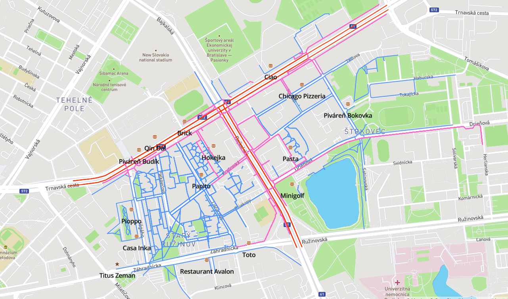

# Overview
This is a web application for joggers. The main purpouse behind it is to give joggers outlook of jogginig related things in the area of their vicinity and thus solve some jogging problems. These problems during jogging are the need to resfesh, smog air for certain streets, not being always able to run towards something interesting, running on bad terrain and finaly running on car roads.
Hence, its functions are:
- show all the jogging routes within certain time distance from your street, which are not roads for cars
- highlight all these routes, with addition of being asphalt covered
- show all highways of certain proximity to these routes because of reasons of unclean and unhealthy air for jogging
and highlight all smog affected jogging routes near those highways
- show all restaurants near these routes for reason of refreshing
- show nearest interesting point(sight) to get to as goal destination

Screenshot of this outlook is: 

The application is devided into [frontend](#frontend), written in javascript, using mapbox API and mapbox.js and [backend](#backend), written in PHP, that connects to PostGIS spatial database. Frontend application sends requests to backend application using [jquery POST methods](#api).

# Frontend
The frontend application and thus all code is inside this HTML page(`index.html`). This page:
- offers HTML with CSS with basic control over user input by button, textfields and checkbox
- converts user inserted time into meters
- sets up a map by calling mapbox functions, sets up its sources and layers 
- sends user input to the backend application, retrieving back geojson data, which than loadds into these map sources

# Backend

The backend application is in one file (`API.php`) and functioning of this application is:
- connects to a postgres database 
- formulates a query based on parameters with which it has been called
- runns the query and results wrapps to geojson features with properties and feature collection

## Data

Data were downloaded as pbf export of Bratislava from mapnik and were transformed by osm2pgsql tool to the osm schema. 
Due to low speed response during certain database requests, index on `Geography(way)` was created in table `planet_osm_line`. Geojson is generated by using `st_asgeojson` function and later wrapped in features in feature collection.

## Api
API used to send data to and back between frontend and backend application is by jquery POST method, that accpets as a 
first argument backend url, than as second argument sent data in format key:value and as third argument it has a function, 
that returns data shown by this backend url and status of succes.

` $.post( "API.php", { data in format - key: value }, function(data,status){ set map source with data returned }`

### Response
Returned data send by backend application are in standard geojson format with properties inside features.These properties are later used in map layer symbol text-field initialisation, to show for example name of the restaurant.

